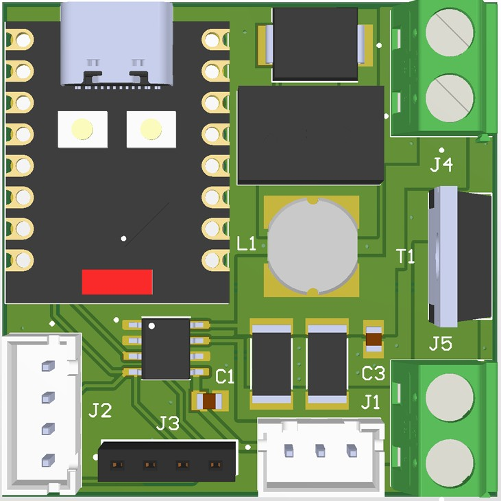
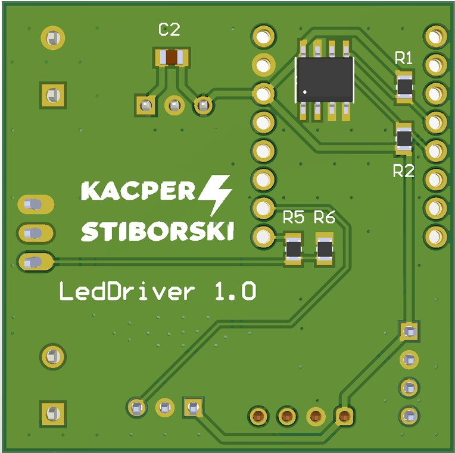

The project involves the creation of a controller based on a microcontroller to control the brightness of lighting (LED 12V - 24V). The device measures the energy consumption of the lighting element, the light intensity in the environment, and detects the presence of a person in the room. It enables manual and automatic or semi-automatic lighting control by setting the set value of the light intensity (in lux automatically or percentage manually) in the room and switching on the light only in the case of human presence. Control is carried out via the http protocol. Additionally, temperature and humidity will be measured in both information and lighting form.

